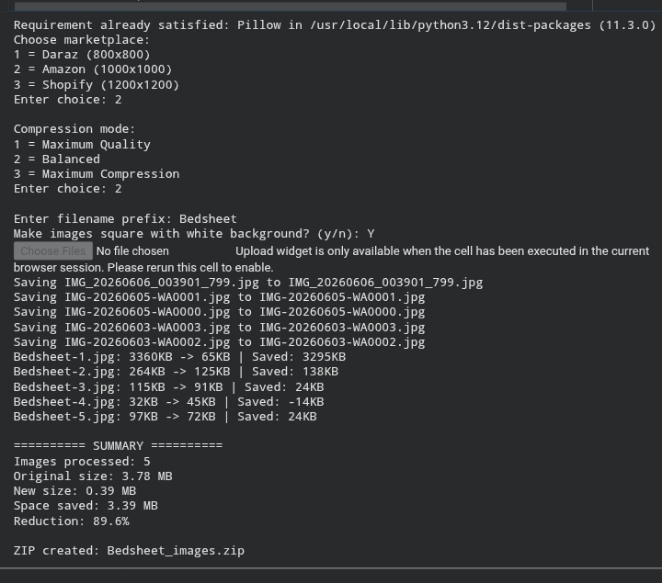

Product Image Optimizer

A Python tool for ecommerce sellers that prepares product images for online marketplaces.

Features

- Bulk image processing
- Marketplace presets (Daraz, Amazon, Shopify)
- Maintains image aspect ratio
- Optional square canvas with white background
- Image compression
- Automatic file renaming
- ZIP export for easy download
- Storage savings report
- Supports JPG, PNG, WEBP, and BMP files

Built With

- Python
- Pillow (PIL)

How It Works

1. Upload product images.
2. Select a marketplace preset.
3. Choose a compression level.
4. Optionally create square images with a white background.
5. Download a ZIP file containing the processed images.

Example Use Cases

- Ecommerce product listings
- Marketplace image preparation
- Product catalog optimization
- Bulk image resizing and compression

Example Output

The screenshot below shows the tool processing multiple product images and generating a ZIP file with optimized results.
## Screenshot

Author

Created by um3rx
